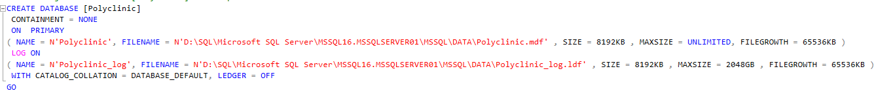
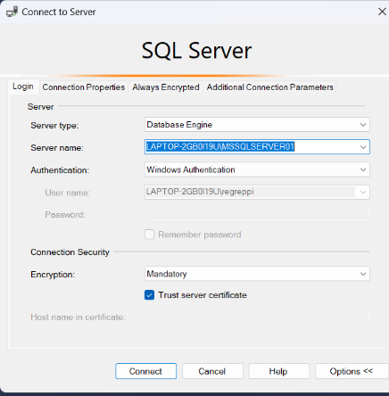

# Руководство по развертыванию приложения

## Установка MSSMS 2022
1. Скачайте и установите Microsoft SQL Server Management Studio (MSSMS) 2022 с официального сайта.

## Создание базы данных
1. Перейдите в папку DataBase и найдите скрипт для создания базы данных.
2. Откройте MSSMS 2022.
3. Выполните следующие шаги:
   - Создайте новое соединение с SQL Server.
   - Откройте скрипт в MSSMS.
   - 
   - Перед выполнением скрипта проверьте, есть ли уже база данных с названием Polyclinic.
   - Если да, измените название базы данных на другое в скрипте во всех строках.
   - При необходимости укажите новый путь хранения базы данных на вашем компьютере в скрипте.
   

4. Запустите скрипт, чтобы создать базу данных.

## Подключение базы данных к проекту
1. Перейдите в файл App.config вашего проекта.
2. Найдите раздел ```<connectionStrings>``` и измените строку подключения следующим образом:

```
<connectionStrings>
    <add name="PolyclinicEntities" connectionString="metadata=res://*/ApplicationData.Model1.csdl|res://*/ApplicationData.Model1.ssdl|res://*/ApplicationData.Model1.msl;provider=System.Data.SqlClient;provider connection string=&quot;data source=ИМЯ_ВАШЕГО_ЛОКАЛЬНОГО_СЕРВЕРА;initial catalog=НАЗВАНИЕ_ВАШЕЙ_БАЗЫ_ДАННЫХ;integrated security=True;encrypt=False;MultipleActiveResultSets=True;App=EntityFramework&quot;" providerName="System.Data.EntityClient" />
</connectionStrings>
```


- В data source укажите имя вашего локального сервера. Название сервера можно посмотреть здесь, при подключении. 
 
- В initial catalog укажите название вашей базы данных.

## Запуск проекта
1. Запустите проект.
2. Зарегистрируйте пользователя (например, админа).
3. Войдите в приложение используя новую учетную запись.

Теперь ваше приложение готово к использованию!