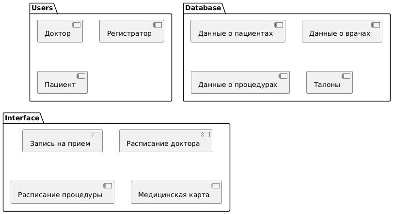
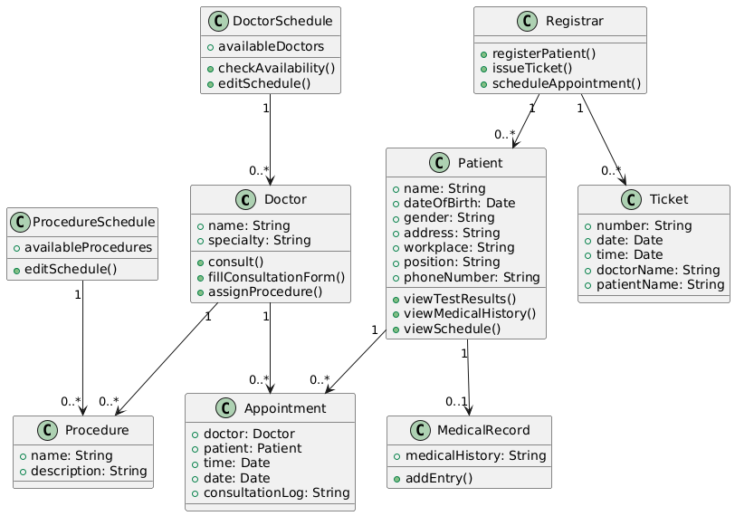

# Архитектура приложения

## Пользовательский интерфейс (UI)
- Технология: WPF
- Описание: Интерфейс представлен в виде окон и элементов управления, обеспечивающих взаимодействие пользователя с системой. 

## Доступ к данным
- Технология: Entity Framework
- Описание: ORM, используемая для работы с базой данных. Обеспечивает взаимодействие с MS SQL Server, выполняя операции CRUD и позволяет управлять данными.

## База данных
- Технология: MS SQL Server
- Описание: Хранит данные системы, включая информацию о пациентах, врачах, записях на прием и другие необходимые данные.

## Диаграмма пакетов 

## Диаграмма классов

