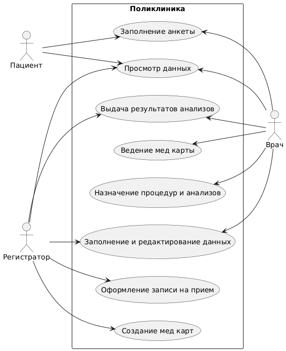

# Приложение по управлению регистратуры поликлиники

Приложение по управлению регистратуры поликлиники для автоматизации процессов регистрации, записи пациентов на приём к врачам, управления записями.

# Пользователи

1. Пациенты  
   Пользуются приложением для просмотра своей медицинской информации.
   - Функциональность:
     - Вход в систему.
     - Просмотр медицинской карты и истории болезни.
     - Просмотр расписания врачей, процедур и анализов.
     - Просмотр справочной информации.

2. Регистраторы  
   Управляют записями, осуществляют корректировку расписаний и ведут учёт данных о пациентах.
   - Функциональность:
     - Регистрация пациентов и создание медицинских карт.
     - Оформление приёма к врачу и выдача талона.
     - Обновление информации о врачах и расписаниях.
     - Выдача результатов анализов.

3. Врачи  
   Получают доступ к своему расписанию, могут просматривать информацию о пациентах и назначать процедуры и заполнять медицинские карты.
   - Функциональность:
     - Вход в систему.
     - Просмотр своего расписания.
     - Просмотр информации о пациенте.
     - Заполнение медицинских карт и назначение процедур и анализов.

4. Администраторы  
   Управляют пользователями и контролируют работу системы.
   - Функциональность:
     - Управление пользователями: создание, редактирование и удаление аккаунтов.
     - Настройка системных параметров и доступов.
     - Контроль работы системы и решение технических вопросов.

# Бизнес процессы поликлиники

- Запись на приём  
  Процесс выбора врача, даты и времени приёма, а также подтверждение записи, выдача талона.
  - Участники: Пациент, Регистратор.

- Управление расписанием  
  Создание и редактирование расписания врачей, процедур и анализов с учётом отпусков и выходных.
  - Участники: Регистратор, Врач, Пациент.

- Регистрация пациентов  
  Процесс регистрации новых пациентов и создание амбулаторных карт.
  - Участники: Регистратор, Пациент.

- Вход в систему
Процесс аутентификации пользователей для получения доступа к медицинской системе.
Участники: Пациент, Врач, Регистратор, Администратор.

- Выдача результатов анализов  
  Процесс информирования пациентов о результатах лабораторных анализов.
  - Участники: Регистратор, Пациент.

- Организация работы врачей  
  Управление назначениями и процедурами, взаимодействие с пациентами по вопросам здоровья.
  - Участники: Врач, Регистратор.

- Поддержка пользователей  
  Обеспечение помощи пациентам и медицинскому персоналу в вопросах доступа и использования системы.
  - Участники: Администратор, Регистратор.

# Взаимосвязь пользователей и процессов

- Пациенты: Участвуют в записи на приём, получении результатов анализов и взаимодействии с врачами.
- Регистраторы: Управляют расписанием, ведут учёт пациентов и помогают в регистрации, создают амбулаторные карты.
- Врачи: Работы с расписанием и информацией о пациентах, назначение процедур и заполнение медицинских карт.
- Администраторы: Контролируют пользователей, настройки системы и её функциональность.

# Диаграмма вариантов использования 

